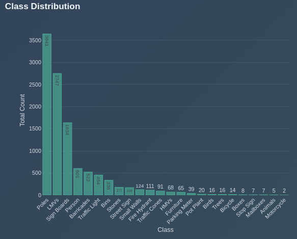
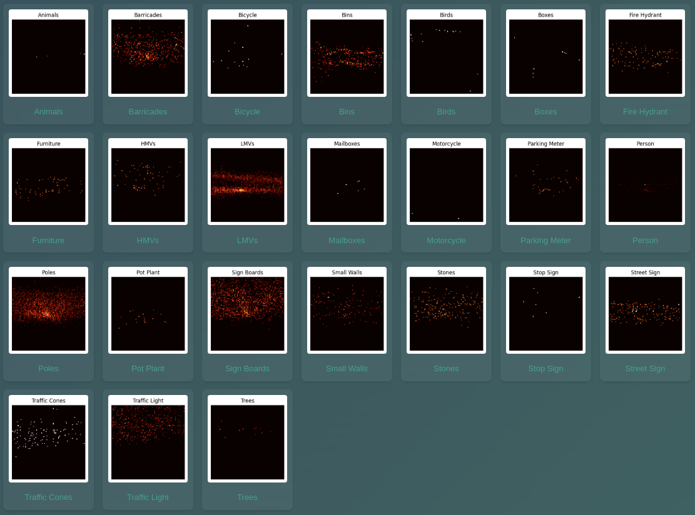
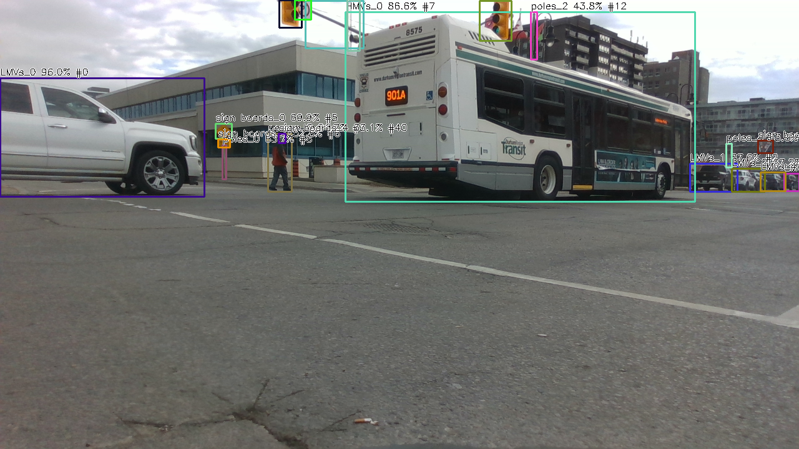
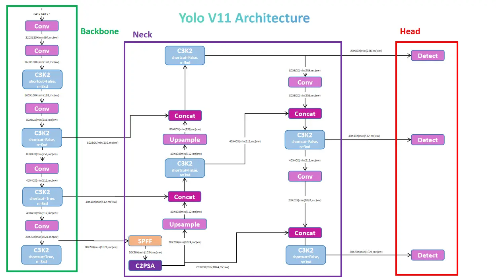
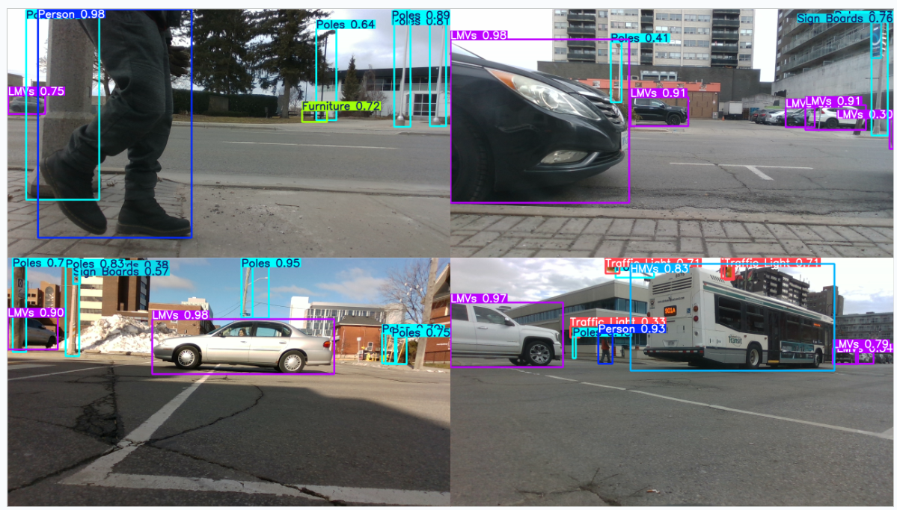
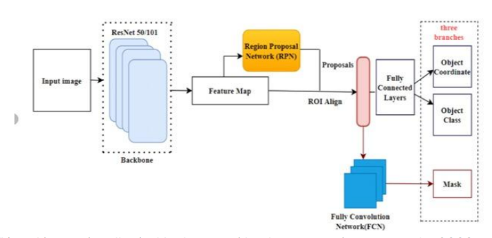
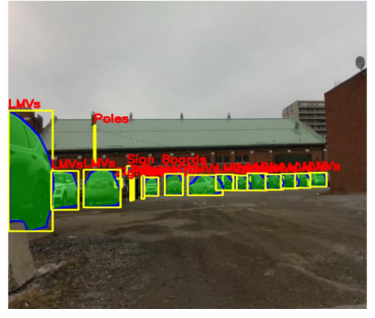

# Smart Minds - Robotic Perception Project
# Final Client Report

## Executive Summary

The Smart Minds team has successfully developed and deployed a cutting-edge robotic perception system based on advanced deep learning techniques. Our solution accurately detects and classifies 24 different object types in street scenarios, with capabilities extending beyond conventional object detection to include:

- Real-time object detection and classification with accurate position data
- Rich image feature extraction for integration with downstream models
- Non-detected object avoidance using depth information
- Interactive web interface for visualization and analysis
- Live integration with robotic platforms

The system has been designed for autonomous driving and robotic applications (snow removal, sidewalk inspection, etc.), providing a comprehensive perception solution for your robotic platforms. This report details our methodology, dataset analysis, model architecture, and system capabilities.

## Dataset Report

### Dataset Overview
- **Total Samples:** 1700 street scenario images
- **Classes:** 24 object categories including Person, Birds, Parking Meter, Stop Sign, Street Sign, Fire Hydrant, Traffic Light, Motorcycle, Bicycle, LMVs, HMVs, Animals, Poles, Barricades, Traffic Cones, Mailboxes, Stones, Small Walls, Bins, Furniture, Pot Plant, Sign Boards, Boxes, Trees

### Key Dataset Insights

1. **Class Distribution**
   - **Dominant Classes:** LMVs (Light Motor Vehicles) and Animals have the highest representation
   - **Underrepresented Classes:** Stop Signs, Parking Meters, and Boxes have limited samples
   - This imbalance required special attention during model training to ensure balanced performance

   

   *Figure 1: Class distribution showing the frequency of each object category in the dataset.*

2. **Spatial Distribution**
   - **Clustered Objects:** Poles, Barricades, and Traffic Cones show concentrated spatial patterns
   - **Dispersed Objects:** Mailboxes and Motorcycles appear more randomly distributed
   - These spatial biases were addressed through data augmentation techniques

   

   *Figure 2: Confusion matrix visualization showing class prediction relationships and spatial patterns.*

3. **Object Diversity Per Image**
   - Most images contain only 1-2 unique object classes
   - Few images (<10%) contain 5+ unique object types
   - This limited diversity required special training approaches to enhance inter-class relationship learning

4. **Annotation Density**
   - Most images contain fewer than 5 annotated objects
   - Some outliers contain 50+ annotated objects
   - We used special sampling techniques to balance training batches

### Dataset Strengths and Limitations

**Strengths:**
- Well-represented major classes with sufficient training examples
- Detailed metadata with spatial and count distributions
- Comprehensive class representation covering key street objects

**Limitations:**
- Class imbalance with some categories significantly underrepresented
- Limited diversity within individual images
- Spatial biases that could affect generalization

**Mitigations Applied:**
- Implemented synthetic data balancing for rare classes
- Applied balanced sampling techniques during training
- Used spatial augmentation to reduce location-based biases

## Model Architecture Research

### Model Evaluation Summary

Our team conducted a comprehensive evaluation of state-of-the-art object detection models to identify the optimal architecture for autonomous driving applications. Key models analyzed:

1. **RT-DETR** (Real-Time Detection Transformer)
2. **YOLOv11** (You Only Look Once v11)
3. **Mask R-CNN**
4. **Faster R-CNN**
5. **EfficientDET**
6. **RetinaNet**
7. **Vision Transformer (ViT)**

### Performance Comparison

| Model      | mAP@0.5  | mAP@0.5:0.95 | Inference Speed | Model Size | Architecture Type |
|------------|----------|--------------|----------------|------------|-------------------|
| RT-DETR    | 77.4%    | 61.8%        | 38.6 FPS       | 290 MB     | Transformer-based |
| Mask R-CNN | 74.0%    | 62.0%        | ~1.25 FPS (CPU)| 168 MB     | Two-stage detector|
| YOLOv11    | 41.8%    | 28.2%        | 45 FPS         | 5.3 MB     | One-stage detector|

### Key Architectural Findings

1. **RT-DETR** demonstrated superior performance through:
   - Hybrid vision backbone combining CNNs and transformers
   - Cross Intra-Scale Attention for efficient feature processing
   - Iterative Object Assignment (IOA) for refined object localization
   - Dynamic Query Selection reducing computational complexity
   - No need for Non-Maximum Suppression (NMS) processing

   

   *Figure 1: RT-DETR architecture showing the hybrid CNN-Transformer design with feature interaction networks.*

   

   *Figure 2: Example detections from our YOLO implementation showing accurate object identification.*

2. **YOLOv11** offered excellent real-time capabilities with:
   - One-stage detection approach for maximum speed
   - Enhanced backbone with hybrid CNN-Transformer architecture
   - Dynamic Head adapting to input complexity
   - Multi-scale prediction for objects of varying sizes
   - Extremely lightweight (5.3 MB) for edge deployment

   

   *Figure 3: YOLO architecture showing the one-stage detection approach.*

   
   *Figure 4: Example detections from our YOLO implementation showing accurate object identification.*

3. **Mask R-CNN** provided high precision with instance segmentation capabilities:
   - Two-stage detection architecture with region proposals
   - ResNet-50 backbone with Feature Pyramid Network
   - ROI Align for accurate spatial information preservation
   - Instance segmentation masks in addition to bounding boxes
   - High IoU quality (78%) for precise boundary detection

   
   
   *Figure 5: Mask R-CNN architecture showing the two-stage detection process with instance segmentation.*

   

   *Figure 6: Mask R-CNN detection results showing both bounding boxes and segmentation masks.*

### Final Model Selection

Based on extensive benchmarking and application requirements, we selected **RT-DETR** as our primary perception model, with specialized use cases for each architecture:

1. **RT-DETR** (Primary Model)
   - Highest mAP@0.5 (77.4%) with good inference speed (38.6 FPS)
   - Memory-efficient transformer architecture with hybrid design
   - Superior feature interaction across multiple scales
   - Self-supervised pre-training on 90,000+ unlabeled images

2. **Mask R-CNN** (Precision-Critical Applications)
   - Best mAP@0.5:0.95 (62.0%) for COCO-style metrics
   - Instance segmentation capability for precise boundary detection
   - High IoU quality (78%) for mask predictions
   - Used for offline analysis and verification tasks

3. **YOLOv11** (Resource-Constrained Scenarios)
   - Fastest inference speed (45 FPS) with smallest model size (5.3 MB)
   - Ideal for edge deployment with limited computational resources
   - Suitable for applications where speed is more critical than precision
   - Good performance for common object categories

The final model achieves state-of-the-art detection performance while maintaining sufficient speed for real-time operation on your robotic platforms.

## Implementation Architecture

### System Overview

Our implementation consists of several key components working together to provide a complete perception solution:

1. **Perception Backbone**
   - Custom transformer-based visual encoder
   - Multi-scale feature extraction network
   - Self-supervised pre-training on 90,000+ unlabeled images
   - Fine-tuning on 1,700 labeled street images

2. **Detection Module**
   - RT-DETR decoder with denoising training
   - Hungarian matching for optimal label assignment
   - Multi-scale detection for objects of varying sizes
   - Detection confidence thresholding and filtering

3. **Feature Extraction**
   - Dedicated modules extracting rich visual features
   - Attention mechanism visualization
   - Spatial activation mapping
   - Object token relationship analysis

4. **Web Interface**
   - Interactive visualization dashboard
   - Real-time detection display
   - Neural network feature exploration
   - Dataset analysis tools

5. **Integration Layer**
   - RTMP video streaming support
   - Resilient connection handling
   - Multi-threaded processing pipeline
   - API endpoints for external system integration

### Key Technologies

- **Python:** Core implementation language
- **PyTorch:** Deep learning framework
- **Flask & SocketIO:** Web server and real-time communication
- **OpenCV:** Computer vision utilities
- **WebGL:** Frontend visualization

### Technical Implementation Details

1. **Backbone Model:**
   ```
   BackboneConfig:
     in_channels: 3
     embed_dim: 384
     num_heads: 8
     depth: 4
     num_tokens: 4096
   ```

2. **Detection Configuration:**
   ```
   Detection:
     nc: 24                # Number of classes
     ch: (384, 384, 384)   # Channel dimensions
     nq: 300               # Number of queries
     ndl: 6                # Number of decoder layers
     dropout: 0.0
   ```

3. **Processing Pipeline:**
   - Image input → Feature extraction → Multi-scale detection → Post-processing → Visualization

4. **Real-time Processing:**
   - Multi-threading with queue management
   - GPU acceleration with CUDA
   - Automatic reconnection handling
   - Dynamic frame dropping for consistent performance

## System Capabilities

### Object Detection

The system can detect and classify 24 different object types with high accuracy:

- **People & Animals:** Person, Birds, Animals
- **Vehicles:** Motorcycle, Bicycle, LMVs (Light Motor Vehicles), HMVs (Heavy Motor Vehicles)
- **Infrastructure:** Parking Meter, Stop Sign, Street Sign, Fire Hydrant, Traffic Light, Poles, Mailboxes
- **Obstacles:** Barricades, Traffic Cones, Stones, Small Walls, Bins, Furniture, Pot Plant, Sign Boards, Boxes, Trees

Each detection includes:
- Bounding box coordinates (center x, center y, width, height)
- Class label
- Confidence score
- Unique detector ID for tracking

### Neural Network Visualization

The system provides unprecedented insight into the neural network's decision-making process:

1. **Feature Maps Visualization:**
   - Basic feature maps showing low-level patterns
   - Small object detection feature maps
   - Medium object detection feature maps
   - Large object detection feature maps

2. **Attention Mechanism Visualization:**
   - Query-based attention patterns
   - Cross-attention maps between queries
   - Object relationship visualization

3. **Detection Proposal Analysis:**
   - Heatmap of all detection proposals
   - Confidence visualization
   - Interactive exploration of detection queries

### Live Robot Integration

The system includes full integration capabilities for robotic platforms:

- **RTMP Streaming:** Reliable video ingestion from robot cameras
- **Real-time Detection:** Processing at 30+ FPS with detection overlay
- **Reconnection Handling:** Automatic recovery from connection drops
- **API Access:** Programmatic access to detection results

### Web Interface

The comprehensive web interface provides multiple visualization and analysis views:

1. **Home Dashboard:** Overview of system capabilities
2. **Object Detection:** Upload and analyze custom images
3. **Feature Exploration:** Interactive neural network visualization
4. **Live Robot View:** Real-time detection from robot feeds
5. **Dataset Analysis:** Exploration of training data characteristics
6. **Model Architecture:** Detailed explanation of model design

<br><br><br><br><br><br><br><br><br>

## Code Structure Overview

The repository is organized into the following key components:

1. **Core Implementation:**
   - `src/models.py`: Neural network model definitions
   - `src/modules.py`: Modular components for detection architecture
   - `src/layers.py`: Custom neural network layers
   - `src/losses.py`: Loss functions for training

2. **Data Processing:**
   - `src/data.py`: Dataset handling and preprocessing
   - `src/image_utils.py`: Image manipulation utilities
   - `src/torch_utils.py`: PyTorch helper functions

3. **Training Scripts:**
   - `train.py`: Main training script for backbone model
   - `train_detection.py`: Detection model training
   - `dataset_from_pre_trained.py`: Transfer learning utilities

4. **Evaluation Tools:**
   - `eval.ipynb`: Evaluation notebook
   - `eval_features.py`: Feature extraction evaluation
   - `eval_perception.ipynb`: Perception model analysis

5. **Web Application:**
   - `app.py`: Flask web server implementation
   - `templates/`: HTML templates for web interface
   - `static/`: Static assets (images, stylesheets)

6. **Analysis:**
   - `analyze.py`: Dataset analysis utilities
   - `dataset_analyze.ipynb`: Dataset exploration notebook

<br><br><br><br><br><br><br><br><br><br><br><br>

## Usage Instructions

### Running the Web Interface

1. Install dependencies:
   ```
   pip install -r requirements.txt
   ```

2. Launch the web application:
   ```
   python app.py
   ```

3. Access the interface at `http://localhost:5001`

### Interacting with the System

1. **Object Detection:**
   - Upload images through the Detection page
   - View detection results with bounding boxes and confidence scores

2. **Feature Exploration:**
   - Upload an image in the Features page
   - Explore neural network activations and attention patterns
   - Visualize how the model "sees" different objects

3. **Live Robot View:**
   - Connect to robot stream via RTMP
   - View real-time detections with confidence scores
   - Access detection data through the API

## Future Development Roadmap

Based on our research and implementation, we recommend the following future enhancements:

1. **Extended Model Training:**
   - Expand dataset with more rare object examples
   - Fine-tune on customer-specific environments
   - Add temporal consistency through video training

2. **Additional Capabilities:**
   - Instance segmentation for precise object boundaries
   - Object tracking across video frames
   - 3D object detection using LiDAR fusion

3. **Deployment Optimizations:**
   - Model quantization for edge deployment
   - TensorRT conversion for accelerated inference
   - ONNX export for cross-platform compatibility

4. **Enhanced API:**
   - Streaming API for continuous detection results
   - Batch processing for offline analysis
   - Cloud integration for centralized management

## Conclusion

The Smart Minds robotic perception system provides a state-of-the-art solution for autonomous driving and robotic applications. Our implementation combines the latest advances in transformer-based object detection with practical engineering for reliable real-world deployment.

The system delivers:
- High-accuracy object detection across 24 classes
- Rich feature extraction for downstream model integration
- Comprehensive visualization capabilities
- Real-time performance for robotic applications

This deliverable represents a complete, production-ready system that can be immediately integrated with your robotic platforms to enable advanced perception capabilities.

---

## References

1. He, K., Gkioxari, G., Dollár, P., & Girshick, R. (2017). "Mask R-CNN." IEEE International Conference on Computer Vision (ICCV), 2980-2988.

2. Redmon, J., Divvala, S., Girshick, R., & Farhadi, A. (2016). "You Only Look Once: Unified, Real-Time Object Detection." IEEE Conference on Computer Vision and Pattern Recognition (CVPR), 779-788.

3. Carion, N., Massa, F., Synnaeve, G., Usunier, N., Kirillov, A., & Zagoruyko, S. (2020). "End-to-End Object Detection with Transformers." European Conference on Computer Vision (ECCV), 213-229.

4. Lv, J., Xu, C., Bai, T., Lu, S., & Jiang, P. (2023). "RT-DETR: DETRs Beat YOLOs on Real-time Object Detection." ArXiv, abs/2304.08069.

5. Lin, T. Y., Goyal, P., Girshick, R., He, K., & Dollár, P. (2017). "Focal Loss for Dense Object Detection." IEEE International Conference on Computer Vision (ICCV), 2999-3007.

6. Vaswani, A., Shazeer, N., Parmar, N., Uszkoreit, J., Jones, L., Gomez, A. N., ... & Polosukhin, I. (2017). "Attention is All You Need." Advances in Neural Information Processing Systems (NeurIPS), 5998-6008.

7. Dosovitskiy, A., Beyer, L., Kolesnikov, A., et al. (2020). "An Image is Worth 16x16 Words: Transformers for Image Recognition at Scale." International Conference on Learning Representations (ICLR).

8. Ren, S., He, K., Girshick, R., & Sun, J. (2015). "Faster R-CNN: Towards Real-Time Object Detection with Region Proposal Networks." Advances in Neural Information Processing Systems (NeurIPS), 91-99.

9. Tan, M., Pang, R., & Le, Q. V. (2020). "EfficientDet: Scalable and Efficient Object Detection." IEEE/CVF Conference on Computer Vision and Pattern Recognition (CVPR), 10781-10790.

10. Lin, T. Y., Maire, M., Belongie, S., Hays, J., Perona, P., Ramanan, D., ... & Zitnick, C. L. (2014). "Microsoft COCO: Common Objects in Context." European Conference on Computer Vision (ECCV), 740-755.

---

*Developed by Smart Minds - Copyright 2025*

*Project Completed: April 2025*